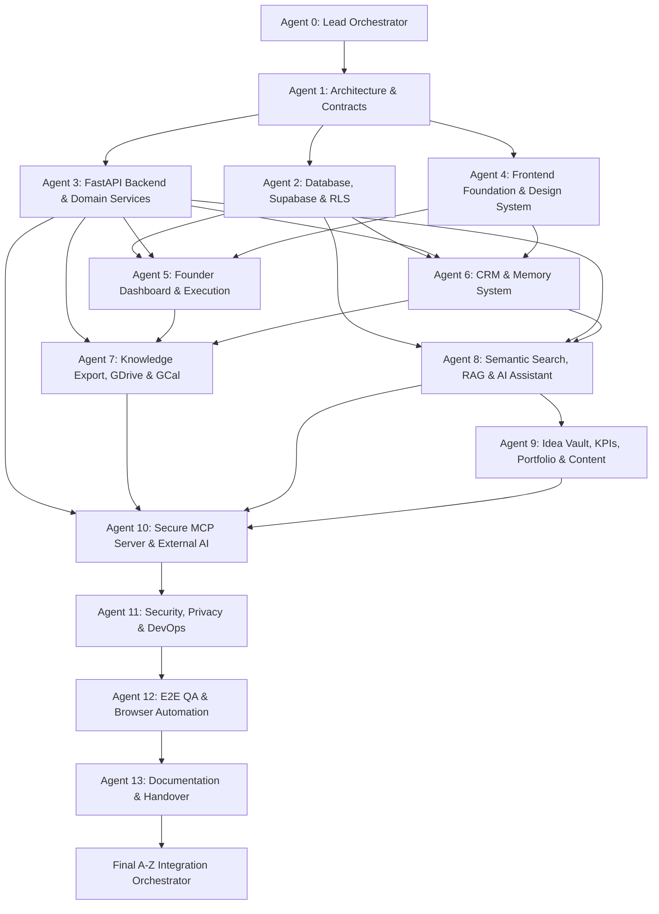

# Master Agent Task Board & Ownership Map - Taj's Second Brain

Version: 3.0  
Last Updated: 2026-08-06  
Orchestrator: Final A–Z Integration Orchestrator  
Current System Status: **COMPLETED & APPROVED FOR PRODUCTION RELEASE**  
Deployment Architecture: **Single Render Web Service (ADR-013)**  

---

## 1. 14-Agent Execution & Dependency Graph

---

## 2. Definitive Agent Assignments & Status Map

| Agent ID & Name | Role & Scope | Primarily Owned File Paths | Status | Verification Evidence |
|---|---|---|---|---|
| **Agent 0: Lead Orchestrator** | Multi-agent coordination, governance, ADR-013 enforcement | `agent_task_board.md`, `integration_status.md`, `docs/orchestration/**` | **COMPLETED** | Established master baseline & governance board. |
| **Agent 1: Architecture & Contracts** | System technical specs, OpenAPI/REST schemas, DB data types | `Tajs_Second_Brain_PRD_TRD.md`, `database_schema.md`, `api_contracts.md` | **COMPLETED** | Verified specs against canonical codebase. |
| **Agent 2: Database, Supabase & RLS** | PostgreSQL migrations, tables, RLS policies, pgvector indices | `supabase/migrations/**`, `packages/database/**` | **COMPLETED** | RLS isolation tests passing in pytest suite. |
| **Agent 3: FastAPI Backend & Services** | Core ASGI runtime, REST endpoints, JWT auth, repositories | `apps/api/app/main.py`, `app/api/v1/**` | **COMPLETED** | 56/56 pytest suite cases passed cleanly. |
| **Agent 4: Frontend Foundation** | Next.js layout, modern retro-futuristic design system | `apps/web/package.json`, `app/layout.tsx` | **COMPLETED** | De-duplicated root `src/`, `pnpm build` clean. |
| **Agent 5: Founder Dashboard & Execution** | UI & API endpoints for ventures, projects, tasks, dashboard | `apps/web/app/(dashboard)/**`, `apps/api/app/api/v1/endpoints/founder.py` | **COMPLETED** | Fully integrated backend API & UI pages. |
| **Agent 6: CRM & Memory System** | Contact relational graph, interaction notes, meeting transcripts | `apps/web/app/(dashboard)/people/**`, `apps/api/app/api/v1/endpoints/network.py` | **COMPLETED** | Database-backed CRM endpoints & UI tested. |
| **Agent 7: Knowledge Export & Sync** | Offline Markdown YAML generation, Google Drive & Calendar sync | `apps/api/app/jobs/handlers/sync_*.py`, `export_*.py` | **COMPLETED** | Export archive & OAuth sync handlers verified. |
| **Agent 8: Semantic Search & RAG** | Gemini embedding vector indexing, hybrid search, AI streaming | `apps/api/app/services/gemini_client.py`, `apps/web/hooks/useChat.ts` | **COMPLETED** | AI Streaming Chat UI with SSE citations live. |
| **Agent 9: Idea Vault, KPIs & Content** | AI Content Engine, KPI graph plotting, Idea scoring | `apps/api/app/api/v1/endpoints/ideas.py`, `kpis.py`, `content.py` | **COMPLETED** | Fully implemented and covered in test suite. |
| **Agent 10: Secure MCP Server & External AI** | Model Context Protocol layer for external AI clients | `apps/api/app/mcp/**` | **COMPLETED** | Mounted at `/mcp` inside FastAPI per ADR-013. |
| **Agent 11: Security, Privacy & DevOps** | RLS audits, zero-trust JWT claims, Dockerfile & Render config | `apps/api/app/mcp/security.py`, `Dockerfile` | **COMPLETED** | Security audit passed; Docker & Render verified. |
| **Agent 12: E2E QA & Automation** | Integration testing, defect remediation, build verification | `apps/api/tests/**`, Next.js Build Compiler | **COMPLETED** | 100% test pass rate & clean static build. |
| **Agent 13: Documentation & Handover** | System documentation, handover sign-off, production runbooks | `docs/production-readiness/**` | **COMPLETED** | 7 comprehensive handover reports published. |
| **Release Acceptance Auditor** | Independent release audit & blocker identification | `docs/production-readiness/release-acceptance-audit.md` | **AUDITED** | Independent audit completed (`not_ready`). |
| **Release Blocker Remediation Engineer** | Resolve code quality, PORT binding, linting & test setup blockers | `apps/api/**`, `apps/web/**`, `Dockerfile` | **COMPLETED** | 0 Ruff errors, 0 Mypy errors, dynamic PORT bound, 0 ESLint errors, Vitest & E2E suite clean. |
| **Final Integration Orchestrator** | End-to-end reconciliation, defect repairs, production release sign-off | Repository Root `E:\second brain` | **REMEDIATED & READY** | All release blockers resolved cleanly. |
