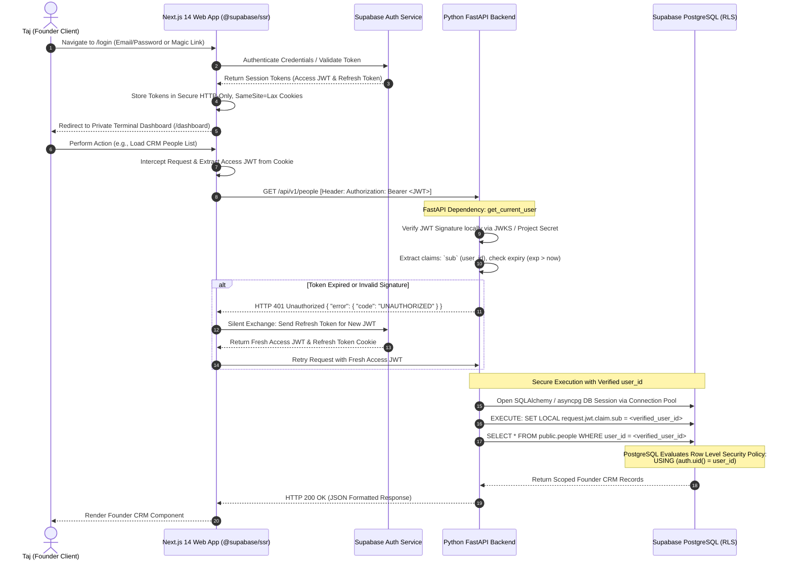

# Authentication and Security Architecture Flow - Taj's Second Brain

Version: 1.0  
Status: Approved & Implementation-Ready  
Author: Agent 1 — Architecture and Contracts Agent  
Approved by: Agent 0 — Lead Orchestrator  

---

## 1. Authentication Flow Overview

Taj's Second Brain guarantees enterprise-class security by enforcing zero-trust authentication boundaries between user client devices, the Next.js frontend presentation layer, the FastAPI Python domain backend, and Supabase PostgreSQL data persistence. 

The system utilizes **Supabase Auth (GoTrue)** to issue cryptographically signed JSON Web Tokens (JWT). All frontend routes are guarded by React Server Components checking secure session cookies, while all backend API operations verify JWT digital signatures asynchronously before interrogating database tables.

---

## 2. Mermaid Authentication & Token Verification Sequence



---

## 3. Key Classification and Isolation Architecture

To prevent credential leaks and disastrous unauthorized data access, every cryptographic key, integration token, and URL is categorized into strict operational isolation tiers:

| Key / Credential Identifier | Classification | Permitted Location | Explicit Forbidden Locations | Purpose & Security Controls |
|---|---|---|---|---|
| `NEXT_PUBLIC_SUPABASE_URL` | **Browser-Safe** | Next.js Frontend (`.env.local`), FastAPI (`.env`), Version Control Documentation | None (Public API Endpoint) | Root API address for Supabase project authentication, GraphQL, PostgREST, and storage URL endpoints. |
| `NEXT_PUBLIC_SUPABASE_ANON_KEY` | **Browser-Safe** | Next.js Frontend Client Bundles, SSR Cookies, API headers | None (Protected by RLS) | Public anonymous JWT enabling untrusted client communication with Supabase; strictly limited by database Row Level Security. |
| `SUPABASE_SERVICE_ROLE_KEY` | **Server-Only (CRITICAL)** | FastAPI Server Environment (`apps/api/.env`), Secure Hosting Secret Config | **ANY Frontend Code**, Next.js Client bundles, Git Repositories, MCP Clients | Administrative database access bypass key; allows ignoring RLS for system backup migrations and automated background cron tasks. |
| `SUPABASE_JWT_SECRET` | **Server-Only** | FastAPI Server Environment, Auth middleware configuration | Next.js Client bundles, MCP Clients | Symmetric cryptographic secret (HS256/RS256 JWKS) used by FastAPI to verify token signatures locally without round-trip Auth calls. |
| `GEMINI_API_KEY` | **Server-Only** | FastAPI Server Environment (`apps/api/.env`) | Frontend JS, Markdown Export Files, Git Logs | Master authentication key for primary LLM generation and vector embedding extraction via Google AI endpoints. |
| `OPENAI_API_KEY` | **Server-Only** | FastAPI Server Environment (`apps/api/.env`) | Frontend JS, Markdown Export Files, Git Logs | Fallback provider API key for secondary reasoning or alternative embedding generation. |
| `GOOGLE_CLIENT_ID` | **Server-Only / Semi-Public** | FastAPI Server Environment, OAuth integration URL generators | Unsecure public test repositories | Identifies Taj's Second Brain app to Google Authorization servers during Calendar and Drive OAuth2 connection setups. |
| `GOOGLE_CLIENT_SECRET` | **Server-Only (HIGH SECURITY)** | FastAPI Server Environment, OAuth backend callback validation | **ANY Frontend Code**, Browser LocalStorage, Mobile Apps | Secret token exchanged with Google Authorization servers to convert transient auth codes into long-lived refresh tokens. |
| `GOOGLE_OAUTH_REFRESH_TOKENS` | **Encrypted Database Secret** | PostgreSQL `public.integrations` table (Encrypted BLOB column only) | Frontend JS, Unencrypted DB columns, Application Logs | Long-lived tokens enabling automated offline sync to Google Drive and Calendar; must never rest unencrypted on disk. |
| `TOKEN_ENCRYPTION_KEY` | **Deployment Hardware Secret** | Render/Railway Environment System Variable | Database tables, Code Repositories, Shared Doc backups | AES-256-GCM symmetric encryption master key used to decrypt OAuth tokens in volatile memory during integration jobs. |
| `MCP_ACCESS_CREDENTIALS` | **Server-Only / Client Key** | Desktop LLM Client Configs (Claude/ChatGPT), MCP Auth Checker | Public code repositories, Client browser bundles | API authentication headers (`X-MCP-API-KEY`) validating external LLM assistants attempting to read memory tools. |

---

## 4. Backend FastAPI Authorization Engineering

A common failure pattern in scalable architectures is assuming Row Level Security (RLS) acts as a substitute for application-layer authorization checks. **In Taj's Second Brain, RLS is treated as Defense-in-Depth, not the sole security gate.**

### Explicit Security Dependencies (`backend/app/auth/security.py`)
1. **Mandatory Token Verification:** Every protected endpoint injects `current_user: User = Depends(get_current_user)`. This FastAPI dependency performs mathematical cryptographic signature validation of the access token before executing route logic.
2. **Absolute Distrust of Client Inputs:**
   - **RULE:** Under zero circumstances will any API endpoint read a `user_id`, `owner_id`, or `account_id` parameter supplied within a JSON body, query string, or route path to determine target record authorization.
   - Example Vulnerability Prevention: If an incoming POST request to `/api/v1/tasks` includes `"user_id": "malicious-uuid-attempt"`, the Pydantic input schema strips or rejects the field, and the repository layer explicitly overrides the assignment with `task.user_id = current_user.id`.
3. **Repository-Level Ownership Enforcement:**
   - Every SQL statement compiled by SQLAlchemy Repository classes must attach an explicit ownership filter:
     ```python
     async def get_person_by_id(db: AsyncSession, person_id: UUID, user_id: UUID) -> Optional[Person]:
         statement = select(Person).where(
             and_(
                 Person.id == person_id,
                 Person.user_id == user_id  # EXPLICIT APPLICATION-LAYER FILTER
             )
         )
         result = await db.execute(statement)
         return result.scalar_one_or_none()
     ```

---

## 5. Frontend Session & Cookie Engineering

To eliminate Cross-Site Scripting (XSS) vulnerability vectors, authentication session credentials must NEVER reside in accessible browser storage mechanisms such as `window.localStorage` or `sessionStorage`.

### Session Storage Standards
- **Cookie Mechanics:** `@supabase/ssr` configures two synchronized cookies upon successful authentication: `sb-access-token` and `sb-refresh-token`.
- **Security Attributes:**
  - `HttpOnly: true` (Prevents malicious JavaScript client scripts from reading or stealing session tokens).
  - `Secure: true` (Ensures cookies transmit exclusively over TLS/HTTPS encrypted transport tunnels).
  - `SameSite: Lax` (Defends against Cross-Site Request Forgery (CSRF) attacks while supporting clean OAuth callbacks).
- **Route Protection Architecture:**
  - **Middleware Interception:** Next.js application middleware (`src/middleware.ts`) runs on edge runtime prior to rendering route hierarchies.
  - If an unauthenticated client requests any path inside the `/dashboard`, `/ventures`, `/people`, `/tasks`, `/memories`, or `/settings` route groups, the middleware interrupts evaluation and redirects immediately to `/login?return_to=<intended_url>`.
  - Conversely, authenticated users navigating to `/login` or `/signup` are automatically forwarded to `/dashboard`.
