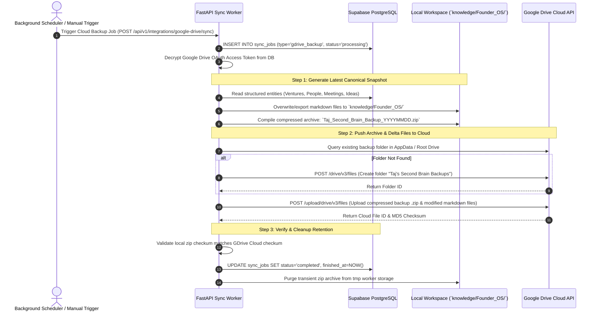

# External Integrations, Export, & Backup Architecture - Taj's Second Brain

Version: 1.0  
Status: Approved & Implementation-Ready  
Author: Agent 1 — Architecture and Contracts Agent  
Approved by: Agent 0 — Lead Orchestrator  

---

## 1. Google OAuth & Cloud Integrations Architecture

Taj’s Second Brain synchronizes founder tasks to Google Calendar and persists universal backup archives to Google Drive. To guarantee total user ownership without jeopardizing external cloud account security, all integrations operate under strict cryptographic authorization boundaries.

### Google OAuth Connection & Token Management Flow
1. **Connection Initiation:** The founder initiates connection via dashboard settings (`POST /api/v1/integrations/google/connect`). The backend constructs a signed OAuth2 authorization request URL soliciting explicit offline access with prompt=consent to yield long-lived refresh tokens.
2. **Minimum Scope Enforceability:** To prevent excessive permission exposure, authorization requests are restricted strictly to:
   - `https://www.googleapis.com/auth/userinfo.email` and `userinfo.profile` (Identity linking).
   - `https://www.googleapis.com/auth/calendar.events` (Read and write schedule events created by or relevant to founder tasks; avoiding global administrative calendar deletion rights).
   - `https://www.googleapis.com/auth/drive.file` or dedicated appdata folder scope (`https://www.googleapis.com/auth/drive.appdata`). **Zero global Drive access (`auth/drive`) is ever requested or accepted.**
3. **Secure Callback & CSRF Validation:** When Google redirects to `GET /api/v1/integrations/google/callback`, the backend verifies the secure one-time cryptographic `state` parameter against stored user session cookies before exchanging the transient authorization code for access and refresh tokens via Google token token endpoints.
4. **Token Storage Encryption:** Raw OAuth access and refresh tokens are immediately encrypted using **AES-256-GCM (Authenticated Symmetric Cryptography)** via the deployment secret `TOKEN_ENCRYPTION_KEY` before persisting into `public.integrations`. Unencrypted OAuth tokens never touch disk storage or appear in application debug logs.
5. **Automated Token Refresh:** When background workers invoke Google APIs, an interceptor checks access token expiration timestamps. If expired, the worker decrypts the refresh token, executes an automated OAuth2 token refresh HTTP exchange with Google Authorization servers, caches the fresh access token, and re-encrypts updated state.
6. **Revocation & Disconnect:** If a user clicks "Disconnect Google Integration" (`POST /api/v1/integrations/google/disconnect`), the backend transmits an explicit revocation HTTP token request directly to `https://oauth2.googleapis.com/revoke` to destroy token validities on Google's authorization servers, then hard-deletes the encrypted connection credentials from `public.integrations`.

---

## 2. Google Calendar Two-Way Sync Mechanics

To ensure founder execution never desynchronizes between the Second Brain command terminal and external mobile schedules, the system runs an automated calendar sync worker:

```
[ Task Created / Updated in Postgres (`public.tasks`) ]
                           │
                           ├─ Task has due_date NOT NULL & priority IN ('high', 'urgent', 'medium')
                           ▼
[ Sync Job Worker Queued (`POST /api/v1/integrations/google-calendar/sync`) ]
                           │
                           ├─ Decrypts GCal Access Token
                           ▼
[ Google Calendar API via HTTP client ]
     ├── INSERT Event (Title: Task Title, Description: Notes + Deep link back to OS App)
     └── RETURN GCal Event ID -> Saved to Postgres `tasks.gcal_event_id`
```

### Duplicate Prevention & Sync Integrity Rules
- **Idempotency Linking:** When an event is created in Google Calendar, the resultant unique Google Event ID (`gcal_event_id`) is stored directly on the `public.tasks` table record. Subsequent modifications to the task due date or status perform an API `PATCH /calendars/primary/events/{gcal_event_id}` update rather than generating duplicating calendar events.
- **Completion Sync:** When a task is marked `status = 'done'` in Taj's Second Brain, the background sync worker modifies the corresponding Google Calendar event color id (green) or appends `[COMPLETED]` to the event title header.

---

## 3. Universal Markdown Export Architecture

To uphold the core philosophy of "Ownership First and Zero Vendor Lock-in", every structured database record is perpetually exportable into a human-readable, Obsidian-compatible local repository located at `knowledge/Founder_OS/`.

### Directory Structure & File Path Conventions
```text
knowledge/Founder_OS/
  ├── Founder_OS_Overview.md            # Daily command summary & active KPI board snapshot
  ├── People/
  │   ├── Yousuf_Imran-a7d9e.md         # Individual CRM contact card with conversation timelines
  │   └── Investor_Lead_Name-8f2c1.md
  ├── Ventures/
  │   ├── justor-ai/
  │   │   ├── Venture_Overview.md       # Vision, mission, strategic positioning
  │   │   ├── Projects/
  │   │   │   └── Legal_AI_Engine-3e4b.md
  │   │   ├── Tasks/
  │   │   │   └── Active_Tasks_List.md  # Markdown table of pending & completed tasks
  │   │   └── Decisions/
  │   │       └── Architecture_Choice-12a.md
  │   ├── zqtion/
  │   └── iexf/
  ├── Meetings/
  │   └── 2026-08-01_Mangosteen_Founder_Meetup.md # Full transcript, audio summaries, action items
  ├── Ideas/
  │   └── AI_Workflow_Automator-8a1c.md # Problem, solution, market analysis score
  ├── Achievements/
  │   └── Justor_AI_MVP_Launch-5b9e.md  # Structured portfolio case study proof
  ├── Content/
  │   └── LinkedIn_Justor_Scaling_Post-7c2a.md # Generated social drafts & publication histories
  └── Weekly_Reviews/
      └── 2026_Week_31_Review-4f1a.md   # AI-generated weekly reflective evaluation
```

### Structured Frontmatter & Export File Mechanics
To ensure that exported markdown files retain programmatic structural integrity for automated database re-ingestion or migration to external AI applications, every exported `.md` file is prefixed with standardized **YAML Frontmatter**:

```yaml
---
id: "8a32d1e0-5c6a-4c9f-9a1c-2e3b4a5d6e7f"
type: "person"
name: "Yousuf Imran"
role: "Founder / Mentor"
company: "Mangosteen Studio"
relationship_type: "mentor"
tags: 
  - "mentor"
  - "startup-execution"
created_at: "2026-07-15T10:00:00Z"
updated_at: "2026-08-01T14:30:00Z"
canonical_uri: "https://app.tajssecondbrain.ai/people/8a32d1e0-5c6a-4c9f-9a1c-2e3b4a5d6e7f"
---

# Yousuf Imran (Founder / Mentor)

**Company:** Mangosteen Studio  
**Industry:** Tech / Software  
**Location:** Dhaka  

## Interaction Timeline

### [2026-08-01] Founder Meetup Dhaka
- **Key Takeaway:** Focus strictly on customer retention metrics; keep initial MVP feature scope extremely narrow.
- **Next Action:** Share Justor AI product update deck by Friday.

---
*Generated by Taj's Second Brain Export Engine.*
```

### Path & Filename Sanitation Rules
To defend against Path Traversal vulnerabilities (`../../Windows/System32` or arbitrary filesystem overwrite attacks) when exporting user-entered names into filenames:
- All titles and labels undergo strict regex sanitization: `[^a-zA-Z0-9_-]` characters are replaced with underscores (`_`).
- Filename suffixes append the initial 5 characters of the entity primary key UUID (`-{uuid[:5]}.md`) to eliminate filename collision bugs when two CRM contacts share identical names.
- The background export worker confirms that the normalized target destination file path resides strictly inside the designated `knowledge/Founder_OS/` canonical workspace directory before writing disk bits.

---

## 4. Google Drive Automatic Cloud Backup & Restoration Flow

To guard against catastrophic hardware failure or local disk erasure, the system maintains an asynchronous cloud backup loop:



### Disaster Restoration Considerations
If a complete database reconstruction is required, an administrator invokes the offline restore command CLI utility (`python -m backend.app.services.gdrive.restore --backup-zip path/to/archive.zip`):
1. The engine unpacks the archive into temporary memory.
2. An AST frontmatter parser inspects all `.md` YAML file headers in topological dependency order (Ventures -> People -> Projects -> Tasks/Interactions).
3. The parser injects the records back into Supabase PostgreSQL tables preserving historical UUIDs and timestamps, then automatically submits job requests to `pgvector` workers to regenerate neural memory search embeddings.
