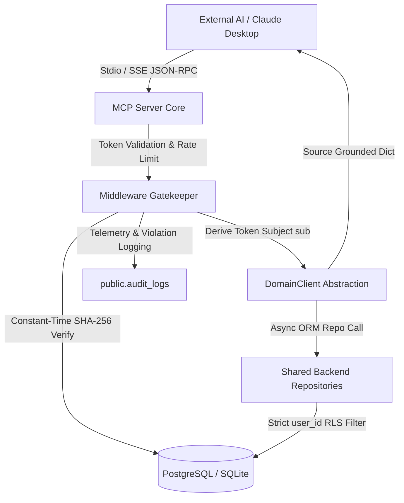

# MCP Server Technical Architecture & Security Model

## Overview
The Secure Model Context Protocol (MCP) Server for Taj's Second Brain is an enterprise-grade integration bridge engineered by **Agent 10**. It enables approved external AI assistants—including Claude Desktop, ChatGPT, Claude Code CLI, and Gemini CLI—to query founder memories, network relationship intelligence (CRM), project milestones, and career portfolio case studies without compromising privacy or architectural boundaries.

## Core Architectural Design (Option A: Repository Direct)
To maximize runtime speed and guarantee schema compatibility without generating duplicate network traffic or writing raw untyped SQL, the Python MCP Server (`apps/mcp-server`) acts as an asynchronous domain service integration layer directly atop the shared FastAPI repositories (`apps/api/app/repositories`).

## Security Principles & Threat Mitigation
1. **Read-Only by Default**: All exploratory tools (`search_people`, `search_memory`, `get_projects`, `get_tasks`, `get_calendar`, `get_relationship_history`) execute strictly under non-destructive database transactions. Content drafting tools generate in-memory structural prototypes and explicitly forbid automatic external publishing.
2. **Never Trust Client-Supplied User IDs**: If an external client parameter attempts to supply a `user_id`, the middleware interceptor rejects or overwrites it with the authenticated identity derived from the API key's cryptographic subject claim.
3. **Zero Raw SQL Constraint**: Absolutely no ad-hoc SQL text statements exist within the MCP server codebase. All queries rely entirely on tested repository wrappers.
4. **Source-Grounded Responses**: Every retrieved entity is decorated with verifiable origin identifiers (`origin_id`), classification type (`source_type`), and direct URI links (`citation_uri`, e.g., `mcp://people/uuid`).
5. **Cryptographic Credential Persistence**: API keys are generated with secure randomness (`sb_mcp_...`), salted with 16-byte random hexadecimal salts, and persisted exclusively as SHA-256 digests inside `public.profiles.settings["mcp_credentials"]`. Verification utilizes `hmac.compare_digest` to defeat timing side-channel attacks.
