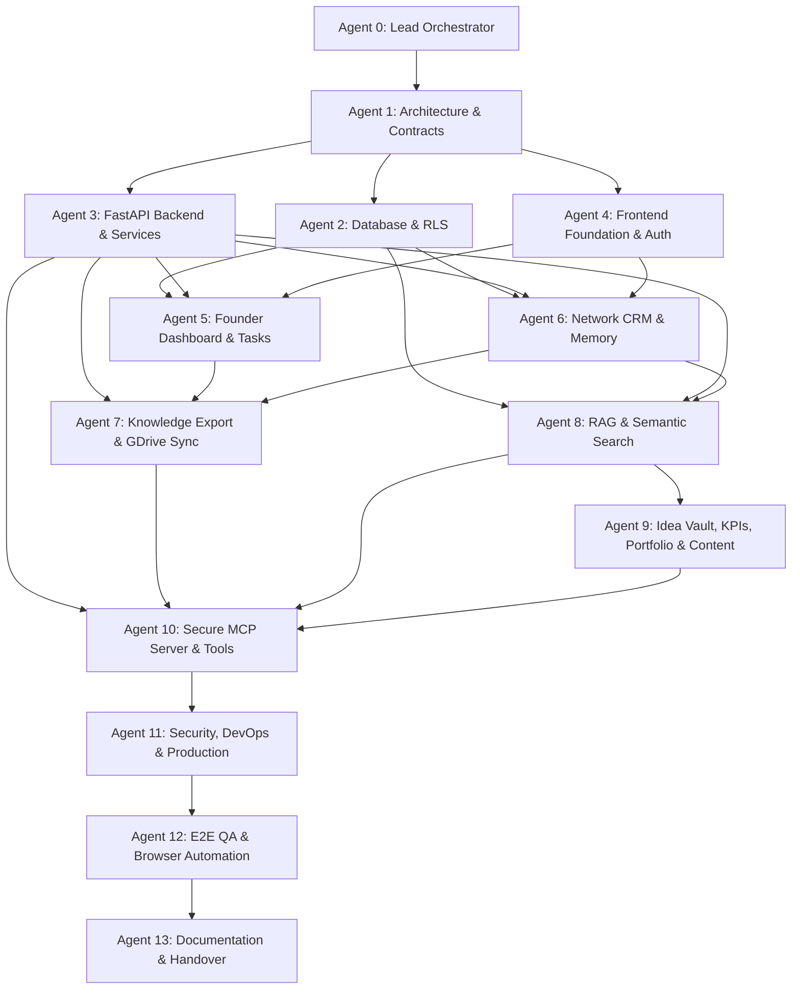

# Master Dependency & Execution Map - Taj's Second Brain

Version: 1.0  
Author: Agent 0 — Lead Orchestrator  

---

## 1. Multi-Agent Sequential & Parallel Flow Graph

---

## 2. Dependency Prerequisites Table

| Target Agent | Prerequisites Required Before Execution | Delivering Agent(s) | Verification Gate |
|---|---|---|---|
| **Agent 1** | PRD/TRD read; Orchestrator task board created | Agent 0 | Complete Architecture & ADRs |
| **Agent 2** | DB table specs, RLS strategy, pgvector schema rules defined in `database_schema.md` | Agent 1 | SQL migrations apply cleanly; RLS tests pass |
| **Agent 3** | Database migrations tables live; API REST contracts defined in `api_contracts.md` | Agent 1, Agent 2 | Pytest passes with DB test seed; OpenAPI spec validates |
| **Agent 4** | JWT verification middleware confirmed; API error formats finalized | Agent 1, Agent 3 | Next.js build passes; Auth JWT login works |
| **Agent 5** | DB execution schemas live; FastAPI execution routers ready; UI shell & navigation ready | Agent 2, 3, 4 | UI dashboard renders; project/task CRUD API tests pass |
| **Agent 6** | CRM & memory schemas live; FastAPI CRM routers ready; UI shell ready | Agent 2, 3, 4 | People CRM graph links properly; audio blob extraction logged |
| **Agent 7** | DB integration & job queue tables live; Token encryption interface implemented by Agent 3 | Agent 2, 3, 5, 6 | Export workers produce YAML-frontmatter `.md`; AES encryption verified |
| **Agent 8** | `pgvector` index live; Document tables exist; `BaseLLMProvider` abstraction interface established | Agent 2, 3, 6 | Hybrid search RRF score returns >0.55 similarity; RAG prompt tests pass |
| **Agent 9** | RAG retrieval pipeline ready; Provider LLM wrapper functional; API endpoints defined | Agent 8 | Content generators produce grounded text; KPI recharts render |
| **Agent 10** | **ADR-013 Compliance:** FastAPI ASGI runtime in `apps/api/` available for route mounting at `/mcp`. Shared domain repositories ready across all domains. | Agent 3, 7, 8, 9 | MCP streamable HTTP mounts cleanly at `/mcp`; tool JSON-RPC calls succeed in read-only mode without bypassing RLS |
| **Agent 11** | Code complete across REST & MCP; all unit tests passing | Agents 1–10 | Zero high-severity vulnerabilities in Bandit / OWASP ZAP; RLS penetration test certified |
| **Agent 12** | Security signed off; test data seeds prepared in test environment | Agent 11 | Playwright E2E suites run with zero console or network exceptions |
| **Agent 13** | All bugfixes completed from QA defect register | Agent 12 | Release artifacts verified; disaster recovery rehydration test certified |

---

## 3. Critical Architectural Handshakes

1. **The Single Render Service Handshake (Agent 3 & Agent 10):**
   - Agent 3 must export its main FastAPI app instance (`app` in `apps/api/app/main.py`).
   - Agent 10 configures its Streamable HTTP application and explicitly calls `app.mount("/mcp", mcp_app)`. Both REST and MCP access identical repositories in `app/repositories/`.
2. **The RAG Grounding Handshake (Agent 8 & Agent 9):**
   - Agent 9's AI Content Engine and Case Study generators must not invoke raw LLM completion APIs. They must assemble prompt contexts exclusively through Agent 8's retrieval pipeline to ensure citations link to canonical database records.
3. **The Offline Snapshot Handshake (Agent 2 & Agent 7):**
   - Agent 7's markdown export engine reads canonical PostgreSQL entities from Agent 2's schema and converts them to deterministic YAML-frontmatter files in `knowledge/Founder_OS/`.
