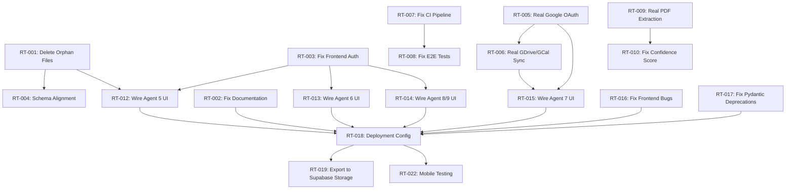

# RECOVERY TASKS — Dependency-Ordered Engineering Work

**Auditor:** Principal Production Recovery Engineer  
**Date:** 2026-08-24  
**Baseline Reference:** [`00_BASELINE_AUDIT.md`](file:///e:/second%20brain/docs/production-recovery/00_BASELINE_AUDIT.md)

---

> [!IMPORTANT]
> This document defines the **ordered dependency graph** for all remaining engineering work.  
> Tasks are grouped into **waves**. Each wave must be completed before the next wave begins.  
> Do NOT skip waves or reorder tasks across waves.

---

## Wave 0 — CRITICAL SECURITY & HYGIENE (P0)
**Prerequisite:** None  
**Blocks:** Everything else  

### RT-001: Delete or Quarantine Orphan Agent 9 Endpoint Prototypes
**Priority:** P0  
**Owner:** Security Engineer  
**Files to Delete or Quarantine:**
- [`apps/api/app/api/v1/endpoints/achievements.py`](file:///e:/second%20brain/apps/api/app/api/v1/endpoints/achievements.py) — Hardcoded UUID, MockDbClient
- [`apps/api/app/api/v1/endpoints/content.py`](file:///e:/second%20brain/apps/api/app/api/v1/endpoints/content.py) — Hardcoded UUID, MockDbClient, mock sources
- [`apps/api/app/api/v1/endpoints/ideas.py`](file:///e:/second%20brain/apps/api/app/api/v1/endpoints/ideas.py) — Hardcoded UUID, MockDbClient
- [`apps/api/app/api/v1/endpoints/kpis.py`](file:///e:/second%20brain/apps/api/app/api/v1/endpoints/kpis.py) — Hardcoded UUID, MockDbClient
- [`apps/api/app/api/v1/endpoints/portfolio.py`](file:///e:/second%20brain/apps/api/app/api/v1/endpoints/portfolio.py) — Hardcoded UUID, MockDbClient
- [`apps/api/app/api/v1/endpoints/dashboard.py`](file:///e:/second%20brain/apps/api/app/api/v1/endpoints/dashboard.py) — 100% hardcoded static response

**Also quarantine orphan Agent 9 repositories** (these use Supabase query-builder client, not SQLAlchemy):
- [`apps/api/app/repositories/achievements.py`](file:///e:/second%20brain/apps/api/app/repositories/achievements.py) (Agent 9 version)
- [`apps/api/app/repositories/content.py`](file:///e:/second%20brain/apps/api/app/repositories/content.py) (Agent 9 version)
- [`apps/api/app/repositories/ideas.py`](file:///e:/second%20brain/apps/api/app/repositories/ideas.py) (Agent 9 version)
- [`apps/api/app/repositories/kpis.py`](file:///e:/second%20brain/apps/api/app/repositories/kpis.py) (Agent 9 version)
- [`apps/api/app/repositories/portfolio.py`](file:///e:/second%20brain/apps/api/app/repositories/portfolio.py) (Agent 9 version)

**Acceptance:** No file in the codebase defines a local `get_current_user_id()` returning a hardcoded UUID. No `MockDbClient` class exists outside of test files.

**Impact of NOT doing:** Anyone can access these endpoints without authentication if they're accidentally mounted.

---

### RT-002: Correct Documentation False Claims
**Priority:** P0  
**Owner:** Documentation Engineer  
**Files to Update:**
- [`integration_status.md`](file:///e:/second%20brain/integration_status.md) — Remove "100% INTEGRATED" claim; replace with honest status matrix
- [`agent_task_board.md`](file:///e:/second%20brain/agent_task_board.md) — Mark Agents 5, 6, 7, 8, 9 frontend work as INCOMPLETE
- [`README.md`](file:///e:/second%20brain/README.md) — Correct test count from "53" to actual count; note frontend stubs

**Acceptance:** No document claims "100% integrated", "production ready", or "56 tests passed" unless independently verified.

---

### RT-003: Fix Frontend Auth Token Retrieval
**Priority:** P0  
**Owner:** Frontend Engineer  
**Files to Fix:**
- [`hooks/usePeople.ts:L52,81,107`](file:///e:/second%20brain/apps/web/hooks/usePeople.ts#L52) — Replace `localStorage.getItem('supabase_session_token')` with Supabase SSR auth client
- [`hooks/useMeetings.ts:L46,75,101`](file:///e:/second%20brain/apps/web/hooks/useMeetings.ts#L46) — Same fix
- [`hooks/useMemories.ts:L48,86,113`](file:///e:/second%20brain/apps/web/hooks/useMemories.ts#L48) — Same fix
- [`people/new/page.tsx:L45,105`](file:///e:/second%20brain/apps/web/app/(dashboard)/people/new/page.tsx#L45) — Same fix
- [`people/[personId]/page.tsx:L25`](file:///e:/second%20brain/apps/web/app/(dashboard)/people/%5BpersonId%5D/page.tsx#L25) — Same fix
- [`memories/new/page.tsx:L45`](file:///e:/second%20brain/apps/web/app/(dashboard)/memories/new/page.tsx#L45) — Same fix
- [`meetings/[meetingId]/page.tsx:L22,58,84`](file:///e:/second%20brain/apps/web/app/(dashboard)/meetings/%5BmeetingId%5D/page.tsx#L22) — Same fix

**Pattern:** Replace raw `fetch('/api/v1/...')` + `localStorage` with the centralized [`FastApiClient`](file:///e:/second%20brain/apps/web/lib/api/browser-client.ts) which properly reads the Supabase SSR session token.

**Acceptance:** `grep -r "localStorage.getItem('supabase_session_token')" apps/web/` returns 0 results.

---

## Wave 1 — INFRASTRUCTURE FOUNDATION (P1)
**Prerequisite:** Wave 0  
**Blocks:** Wave 2, 3  

### RT-004: Fix SQLAlchemy ↔ Migration Schema Alignment
**Priority:** P1  
**Owner:** Backend Engineer  
**Scope:**
- Audit all 56 migration tables against 26 SQLAlchemy models.
- Add missing junction table models OR document that they are managed via raw SQL / Supabase client only.
- Fix `JobRecord` → table name mismatch (`jobs` vs `sync_jobs`/`export_jobs`).
- Fix `ExportRecord` → table name mismatch (`exports` vs `export_jobs`).
- Fix `MemoryEmbedding.embedding` → change to appropriate pgvector-compatible type decorator.

**Acceptance:** A test verifies that all SQLAlchemy model `__tablename__` values exist in the migration SQL.

---

### RT-005: Implement Real Google OAuth2 Flow
**Priority:** P1  
**Owner:** Integration Engineer  
**Scope:**
- Replace simulated refresh token in [`google_client.py:L24`](file:///e:/second%20brain/apps/api/app/integrations/google_client.py#L24) with actual `google-auth-oauthlib` token exchange.
- Add `GOOGLE_CLIENT_ID` and `GOOGLE_CLIENT_SECRET` to production config validator.
- Remove hardcoded `founder.root@tajssecondbrain.ai` email.
- Implement token refresh logic.

**Acceptance:** `grep -r "simulated_refresh_token" apps/api/` returns 0 results.

---

### RT-006: Implement Real Google Drive & Calendar Sync
**Priority:** P1  
**Owner:** Integration Engineer  
**Prerequisite:** RT-005  
**Scope:**
- Replace [`sync_google.py:L17-31`](file:///e:/second%20brain/apps/api/app/jobs/handlers/sync_google.py#L17-L31) hardcoded responses with actual Google Drive API v3 and Calendar API v3 calls.
- Use decrypted OAuth tokens from integration repository.

**Acceptance:** `grep -r "synced_files_count.*14" apps/api/` returns 0 results.

---

### RT-007: Fix CI Pipeline Gaps
**Priority:** P1  
**Owner:** DevOps Engineer  
**File:** [`.github/workflows/security_ci.yml`](file:///e:/second%20brain/.github/workflows/security_ci.yml)  
**Add missing steps:**
1. `mypy apps/api` (already installed, never invoked)
2. `pnpm test` (Vitest unit tests)
3. `pnpm test:e2e` (Playwright E2E — after RT-009)
4. Consider adding `supabase test db` for pgTAP tests

**Acceptance:** CI pipeline runs mypy, vitest, and reports all results.

---

### RT-008: Fix Playwright E2E Tests
**Priority:** P1  
**Owner:** QA Engineer  
**File:** [`e2e/essential-flows.spec.ts`](file:///e:/second%20brain/apps/web/e2e/essential-flows.spec.ts)  
**Scope:**
- Replace all `toBeDefined()` assertions with `toBeVisible()` or similar Playwright assertions.
- Add authentication fixture/setup to establish session before visiting protected routes.
- Add meaningful assertions that verify actual page content.

**Acceptance:** E2E tests fail when expected elements are missing; pass only when elements are truly visible.

---

### RT-009: Implement Real Document Text Extraction
**Priority:** P1  
**Owner:** Backend Engineer  
**File:** [`document_processing.py:L25`](file:///e:/second%20brain/apps/api/app/jobs/handlers/document_processing.py#L25)  
**Scope:**
- Replace `f"[Extracted knowledge from {doc.sanitized_filename}]"` with actual PDF text extraction using `pdfplumber`, `PyPDF2`, or `pdfminer`.
- Add to `requirements.txt`.

**Acceptance:** PDF upload extracts actual text content from the file.

---

### RT-010: Fix Hardcoded AI Confidence Score
**Priority:** P1  
**Owner:** Backend Engineer  
**File:** [`retrieval.py:L45`](file:///e:/second%20brain/apps/api/app/ai/retrieval.py#L45)  
**Scope:**
- Replace hardcoded `score=0.89` with actual cosine similarity score from vector search.

**Acceptance:** Confidence scores reflect actual vector similarity distances.

---

### RT-011: Fix Hardcoded Dashboard Insights
**Priority:** P1  
**Owner:** Backend Engineer  
**File:** [`founder.py` — `DashboardService.get_insights()` L319-325](file:///e:/second%20brain/apps/api/app/services/founder.py#L319-L325)  
**Scope:**
- Replace hardcoded `attention_required_projects=["Project Alpha", "Q3 Fundraise Prep"]`, `productivity_velocity=1.24`, and `recommendations=[...]` with real computed values from database queries.

**Acceptance:** Dashboard insights are computed from actual user data.

---

## Wave 2 — FRONTEND INTEGRATION (P2)
**Prerequisite:** Wave 0, Wave 1  
**Blocks:** Wave 3  

### RT-012: Wire Venture/Project/Task CRUD UI (Agent 5 Scope)
**Priority:** P2  
**Owner:** Frontend Engineer  
**Pages:**
- [`ventures/page.tsx`](file:///e:/second%20brain/apps/web/app/(dashboard)/ventures/page.tsx) — Replace STUB with list view calling `GET /api/v1/ventures`
- [`projects/page.tsx`](file:///e:/second%20brain/apps/web/app/(dashboard)/projects/page.tsx) — Replace STUB with list view calling `GET /api/v1/projects`
- [`tasks/page.tsx`](file:///e:/second%20brain/apps/web/app/(dashboard)/tasks/page.tsx) — Replace STUB with list/board view calling `GET /api/v1/tasks`
- [`dashboard/page.tsx`](file:///e:/second%20brain/apps/web/app/(dashboard)/dashboard/page.tsx) — Replace EmptyState with summary calling `GET /api/v1/dashboard/summary`

**Prerequisite:** Backend endpoints exist and are authenticated (verified ✓).

**Acceptance:** No toast with "STUB" or "Agent 5" text appears on these pages.

---

### RT-013: Wire CRM/Memory UI (Agent 6 Scope)
**Priority:** P2  
**Owner:** Frontend Engineer  
**Pages:**
- [`people/page.tsx`](file:///e:/second%20brain/apps/web/app/(dashboard)/people/page.tsx) — Replace STUB with people list
- [`organizations/page.tsx`](file:///e:/second%20brain/apps/web/app/(dashboard)/organizations/page.tsx) — Replace STUB with org list
- [`meetings/page.tsx`](file:///e:/second%20brain/apps/web/app/(dashboard)/meetings/page.tsx) — Replace STUB with meetings list
- [`memories/page.tsx`](file:///e:/second%20brain/apps/web/app/(dashboard)/memories/page.tsx) — Replace STUB with memories list

**Also fix:**
- Dead link in `people/[personId]` to non-existent `/interactions/new` route
- Dead link to non-existent `/people/.../edit` route
- N+1 fetch loop in `meetings/[meetingId]` (Lines 36-42)
- Replace `alert()` with toast in `meetings/[meetingId]`

**Acceptance:** No toast with "STUB" or "Agent 6" text appears on these pages.

---

### RT-014: Wire Ideas/KPIs/Content/Achievements UI (Agent 8/9 Scope)
**Priority:** P2  
**Owner:** Frontend Engineer  
**Pages:**
- [`ideas/page.tsx`](file:///e:/second%20brain/apps/web/app/(dashboard)/ideas/page.tsx) — Replace STUB
- [`kpis/page.tsx`](file:///e:/second%20brain/apps/web/app/(dashboard)/kpis/page.tsx) — Replace STUB
- [`content/page.tsx`](file:///e:/second%20brain/apps/web/app/(dashboard)/content/page.tsx) — Replace STUB
- [`achievements/page.tsx`](file:///e:/second%20brain/apps/web/app/(dashboard)/achievements/page.tsx) — Replace STUB

**Acceptance:** No toast with "STUB" or "Agent 8" text appears.

---

### RT-015: Wire Integration/Export Settings UI (Agent 7 Scope)
**Priority:** P2  
**Owner:** Frontend Engineer  
**Pages:**
- [`settings/integrations/page.tsx`](file:///e:/second%20brain/apps/web/app/(dashboard)/settings/integrations/page.tsx) — Replace STUB with real OAuth connect flow
- [`settings/export/page.tsx`](file:///e:/second%20brain/apps/web/app/(dashboard)/settings/export/page.tsx) — Replace STUB with real export triggers

**Prerequisite:** RT-005 (real Google OAuth).

**Acceptance:** No toast with "STUB" or "Agent 7" text appears.

---

### RT-016: Fix Frontend Bugs
**Priority:** P2  
**Owner:** Frontend Engineer  
**Scope:**
- Fix impossible logic in [`breadcrumbs.tsx:L12`](file:///e:/second%20brain/apps/web/components/layout/breadcrumbs.tsx#L12)
- Remove unused `Dialog` import in [`command-menu.tsx:L6`](file:///e:/second%20brain/apps/web/components/layout/command-menu.tsx#L6)
- Fix `env.ts` default fallback to `https://mock.supabase.co` — should throw instead of silently using mock URL

**Acceptance:** `grep -r "mock.supabase.co" apps/web/lib/` returns 0 results.

---

### RT-017: Fix Pydantic V1 Deprecations
**Priority:** P2  
**Owner:** Backend Engineer  
**Files:**
- [`schemas/crm.py`](file:///e:/second%20brain/apps/api/app/schemas/crm.py) — Replace `@validator` → `@field_validator`, `class Config` → `ConfigDict`
- [`schemas/interactions.py`](file:///e:/second%20brain/apps/api/app/schemas/interactions.py) — Same
- [`schemas/meetings.py`](file:///e:/second%20brain/apps/api/app/schemas/meetings.py) — Same
- [`schemas/memories.py`](file:///e:/second%20brain/apps/api/app/schemas/memories.py) — Same

**Acceptance:** `pytest` runs with 0 Pydantic deprecation warnings.

---

## Wave 3 — PRODUCTION READINESS (P2-P3)
**Prerequisite:** Wave 0, 1, 2  

### RT-018: Create Deployment Configuration
**Priority:** P2  
**Owner:** DevOps Engineer  
**Scope:**
- Create `render.yaml` for API deployment
- Create `vercel.json` for frontend deployment (or confirm Vercel auto-detects)
- Fix `docker-compose.yml` to not reference `.env.example` as default env_file

---

### RT-019: Export to Supabase Storage (Not Local Disk)
**Priority:** P2  
**Owner:** Backend Engineer  
**File:** [`export_markdown.py`](file:///e:/second%20brain/apps/api/app/jobs/handlers/export_markdown.py)  
**Scope:**
- Replace local disk writes with Supabase Storage bucket uploads.

---

### RT-020: Fix `pnpm-workspace.yaml` Placeholder
**Priority:** P3  
**Owner:** DevOps Engineer  
**File:** [`pnpm-workspace.yaml`](file:///e:/second%20brain/pnpm-workspace.yaml)  
**Scope:** Fix Lines 5-6 `set this to true or false`.

---

### RT-021: Add Missing Frontend Route Pages
**Priority:** P3  
**Owner:** Frontend Engineer  
**Missing routes:**
- `/interactions/new` (linked from `people/[personId]`)
- `/people/[personId]/edit` (linked from `people/[personId]`)
- `/decisions` (backend exists, no frontend)

---

### RT-022: Mobile Responsiveness Testing
**Priority:** P3  
**Owner:** QA Engineer  
**Scope:** Execute Playwright "Mobile Chrome" project against all dashboard routes.

---

## Dependency Graph

---

## What Should NOT Be Built Yet

> [!WARNING]
> The following features should NOT be started until Waves 0 and 1 are complete:

1. **No new frontend pages** until RT-003 (auth fix) and RT-001 (orphan cleanup) are done.
2. **No Google integration features** until RT-005 (real OAuth) is implemented.
3. **No AI-powered features relying on real Gemini output** until real API keys are provisioned and tested.
4. **No deployment to production** until RT-001, RT-002, RT-003, RT-005, RT-007 are all verified.
5. **No new database migrations** until RT-004 (schema alignment) resolves model/migration divergence.
6. **No weekly review or content generation features** until AI provider returns real responses (not simulated).

---

## Recommended Execution Order

| Order | Task IDs | Effort Est. | Parallel? |
|---|---|---|---|
| 1 | RT-001, RT-002, RT-003 | 2-4 hours | Yes (3 engineers) |
| 2 | RT-004, RT-005, RT-007, RT-008 | 1-3 days | Yes (4 engineers) |
| 3 | RT-006, RT-009, RT-010, RT-011 | 1-2 days | Yes (2 engineers) |
| 4 | RT-012, RT-013, RT-014, RT-015 | 3-5 days | Yes (2-3 engineers) |
| 5 | RT-016, RT-017 | 0.5-1 day | Yes |
| 6 | RT-018, RT-019, RT-020, RT-021, RT-022 | 1-2 days | Yes |
