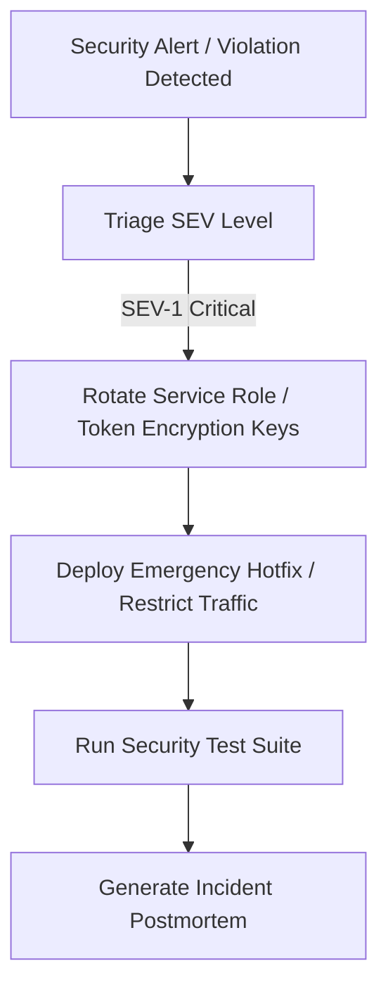

# Incident Response & Private Data Exposure Runbook — Taj's Second Brain

Version: 1.0  
Author: Agent 11 — Security, Privacy, DevSecOps, SRE & Production Readiness Agent  
Date: 2026-08-05  

---

## 1. Severity Levels & Escalation Matrix

| Severity | Definition | Response SLA | Action Required |
|---|---|---|---|
| **SEV-1 (CRITICAL)** | Confirmed cross-user data leakage, unauthenticated RLS bypass, or master secret compromise (`SUPABASE_SERVICE_ROLE_KEY`, `TOKEN_ENCRYPTION_KEY`). | Immediate (< 15 mins) | Revoke keys, initiate emergency traffic halt, notify Agent 0/Owner, apply containment patch. |
| **SEV-2 (HIGH)** | Service disruption of critical core API, OAuth sync failures, or rate-limiting failure under abuse. | < 1 hour | Isolate impacted service, inspect logs, apply bug fix, restart instances. |
| **SEV-3 (MEDIUM)** | Minor API bug, non-critical tool failure in MCP, or single non-sensitive component error. | < 24 hours | Standard hotfix PR deployment. |

---

## 2. Containment & Remediation Workflow

### SEV-1 Action Checklist
1. **Rotate Compromised Keys**: Immediately replace `SUPABASE_SERVICE_ROLE_KEY` and `TOKEN_ENCRYPTION_KEY` in environment vaults.
2. **Revoke Active Sessions**: Invalidate all active user JWT tokens via Supabase Auth admin console.
3. **Audit Exfiltration Scope**: Query `public.audit_logs` for `user_id` and request IP ranges during the breach window.
4. **Deploy Hotfix**: Push verified security hotfix passing `apps/api/tests/test_security_suite.py`.
